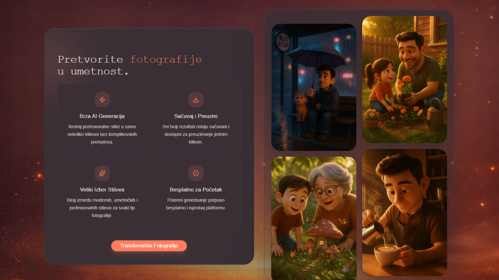

# Veseli Piksel

https://veselipiksel.vercel.app

[Live demo](https://veselipiksel.vercel.app/)

Veseli Piksel is a web app for generating stylized AI portraits and images without writing prompts or adjusting complex settings. The user uploads an image, chooses a style, previews the direction, and generates a result with one click.

## Problem

Most AI image tools require prompt writing, model knowledge, and a lot of trial and error. Veseli Piksel simplifies that workflow into a guided experience:

- upload a photo
- choose a category and style
- preview how the result can look
- generate with one click
- keep previous generations in history

The goal is to make AI image styling fast, predictable, and approachable for users who want a polished result without technical setup.

## Features

- AI image styling powered by OpenAI image models
- curated styles for animated characters, portraits, and business portraits
- original/result preview before generation
- user accounts and authentication
- monthly generation quota tracking
- private generation history
- responsive landing page and studio interface

## Tech Stack

- **Framework:** Next.js App Router
- **UI:** Tailwind CSS, shadcn/ui, Motion
- **Auth and billing:** Clerk
- **AI:** OpenAI image models through the AI SDK
- **Database:** Neon PostgreSQL and Drizzle ORM
- **Media:** ImageKit
- **Monitoring and deployment:** Sentry and Vercel
